# คู่มือการใช้งานระบบเช็คชื่อนักเรียนรายวัน

คู่มือนี้อธิบายการตั้งค่าระบบครั้งแรก การใช้งานสำหรับครู และการจัดการข้อมูลสำหรับผู้ดูแลระบบ (Admin)

## สารบัญ

- [1. การตั้งค่าระบบครั้งแรก](#1-การตั้งค่าระบบครั้งแรก)
- [2. การเข้าสู่ระบบ](#2-การเข้าสู่ระบบ)
  - [2.1 เข้าสู่ระบบสำหรับครู](#21-เข้าสู่ระบบสำหรับครู)
  - [2.2 เข้าสู่ระบบสำหรับ Admin](#22-เข้าสู่ระบบสำหรับ-admin)
- [3. การใช้งานสำหรับครู](#3-การใช้งานสำหรับครู)
  - [3.1 ดูภาพรวมรายวัน](#31-ดูภาพรวมรายวัน)
  - [3.2 เช็คชื่อรายห้อง](#32-เช็คชื่อรายห้อง)
  - [3.3 ดูสถิติละเอียด](#33-ดูสถิติละเอียด)
  - [3.4 ออกจากระบบ](#34-ออกจากระบบ)
- [4. การใช้งานสำหรับ Admin](#4-การใช้งานสำหรับ-admin)
  - [4.1 ตั้งค่าระบบและเปลี่ยนรหัสผ่าน](#41-ตั้งค่าระบบและเปลี่ยนรหัสผ่าน)
  - [4.2 จัดการปีการศึกษาและเทอม](#42-จัดการปีการศึกษาและเทอม)
  - [4.3 จัดการห้องเรียน](#43-จัดการห้องเรียน)
  - [4.4 จัดการรายชื่อนักเรียน](#44-จัดการรายชื่อนักเรียน)
  - [4.5 นำเข้านักเรียนด้วย CSV](#45-นำเข้านักเรียนด้วย-csv)
  - [4.6 บังคับลบนักเรียนและประวัติการเช็คชื่อ](#46-บังคับลบนักเรียนและประวัติการเช็คชื่อ)
- [5. แนวทางดูแลข้อมูล](#5-แนวทางดูแลข้อมูล)
- [6. การแก้ไขปัญหาเบื้องต้น](#6-การแก้ไขปัญหาเบื้องต้น)

## 1. การตั้งค่าระบบครั้งแรก

เมื่อเปิดเว็บไซต์เป็นครั้งแรก ระบบจะแสดงหน้า **ตั้งค่าระบบครั้งแรก** ดังภาพ

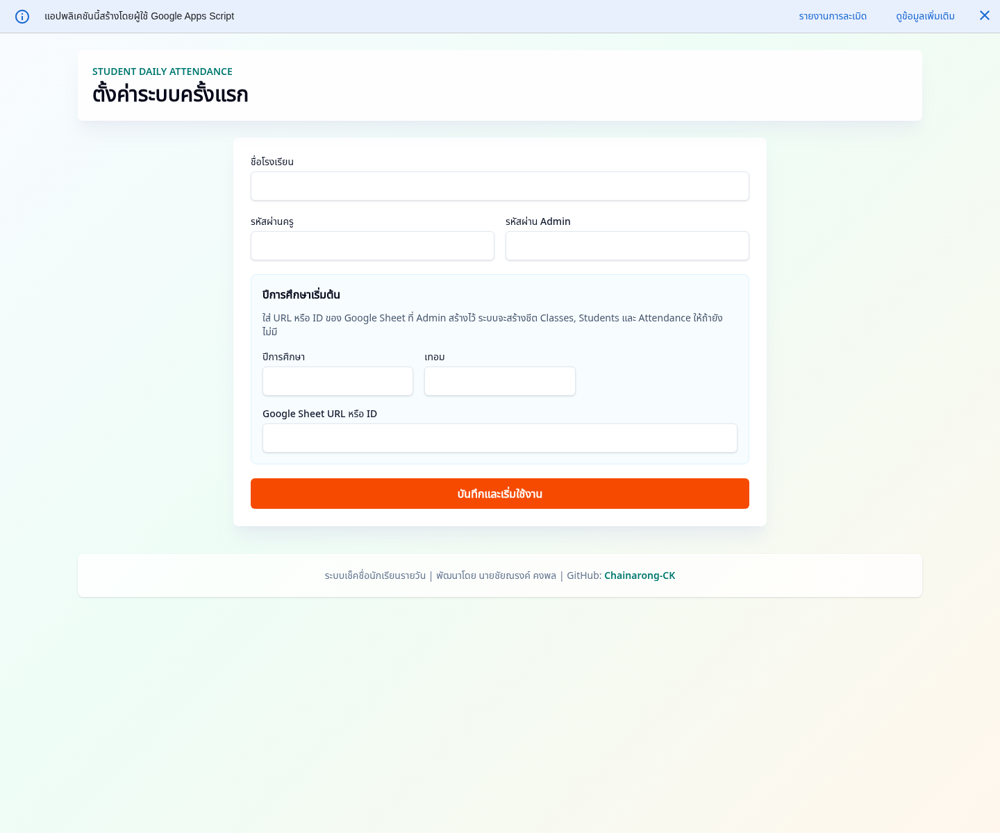

เตรียมข้อมูลต่อไปนี้ก่อนเริ่มตั้งค่า

- ชื่อโรงเรียน
- รหัสผ่านสำหรับครู
- รหัสผ่านสำหรับ Admin
- ปีการศึกษาและเทอมที่ต้องการเริ่มใช้งาน
- URL หรือ ID ของ Google Sheet ที่จะใช้เก็บข้อมูล

> **สำคัญ:** deployment เริ่มต้นเปิดรับผู้ใช้แบบ anonymous และผู้ที่เปิด URL ได้ก่อนระบบตั้งค่าเสร็จสามารถเข้าหน้า Setup ได้ เจ้าของระบบควรควบคุมการเข้าถึงและไม่แจก URL จนกว่าจะทำขั้นตอนนี้สำเร็จ

กรอกข้อมูลตามลำดับต่อไปนี้

1. กรอกชื่อสถานศึกษาในช่อง **ชื่อโรงเรียน**
2. กำหนดรหัสผ่านสำหรับผู้ใช้งานทั่วไปในช่อง **รหัสผ่านครู**
3. กำหนดรหัสผ่านสำหรับผู้ดูแลระบบในช่อง **รหัสผ่าน Admin**
4. กรอกปีการศึกษา เช่น `2569`
5. กรอกเทอมเป็นตัวเลข `1`, `2` หรือ `3`
6. วาง URL หรือ ID ของ Google Sheet ในช่อง **Google Sheet URL หรือ ID**
7. ตรวจสอบข้อมูลให้ถูกต้อง แล้วกด **บันทึกและเริ่มใช้งาน**

ระบบจะสร้างชีต `Classes`, `Students`, `Attendance` และ `ReportTemplates` ใน Google Sheet ให้อัตโนมัติหากยังไม่มี และจะพาไปหน้า Login เมื่อตั้งค่าสำเร็จ

> **ข้อควรระวัง:** ควรเก็บรหัสผ่านครูและรหัสผ่าน Admin ไว้ในที่ปลอดภัย และไม่ควรใช้รหัสเดียวกัน ผู้ deploy ระบบต้องมีสิทธิ์แก้ไข Google Sheet ที่ระบุ

## 2. การเข้าสู่ระบบ

ระบบแบ่งการเข้าสู่ระบบเป็น 2 บทบาท ได้แก่ **ครู** และ **Admin** โดยแต่ละบทบาทใช้รหัสผ่านที่กำหนดไว้ในขั้นตอนตั้งค่าระบบ

### 2.1 เข้าสู่ระบบสำหรับครู

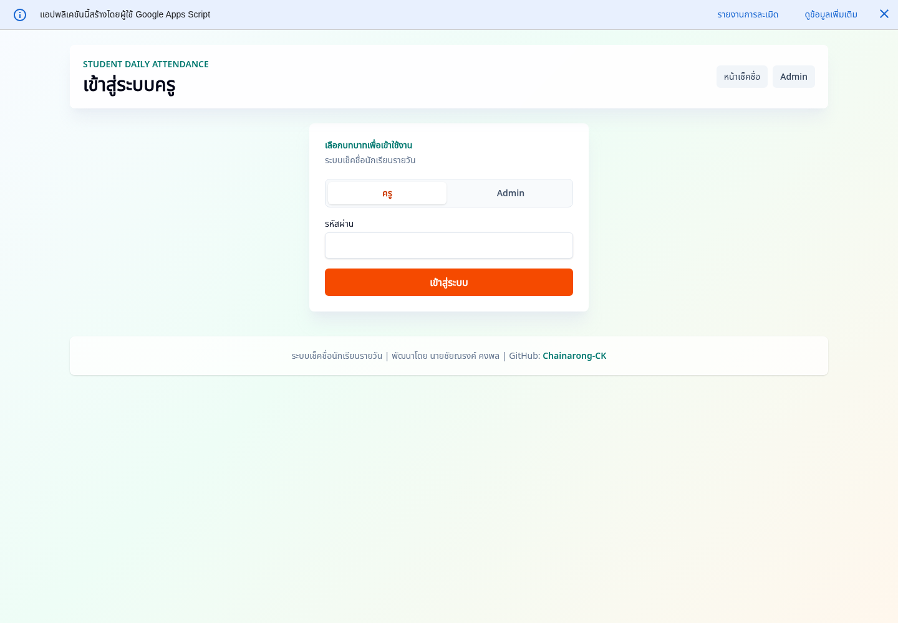

1. เปิดเว็บไซต์ระบบ
2. ตรวจสอบว่าแถบบทบาทเลือก **ครู** อยู่ หากยังไม่ได้เลือกให้กดคำว่า **ครู**
3. กรอกรหัสผ่านครูในช่อง **รหัสผ่าน**
4. กด **เข้าสู่ระบบ**
5. เมื่อรหัสผ่านถูกต้อง ระบบจะพาไปหน้าเช็คชื่อ

### 2.2 เข้าสู่ระบบสำหรับ Admin

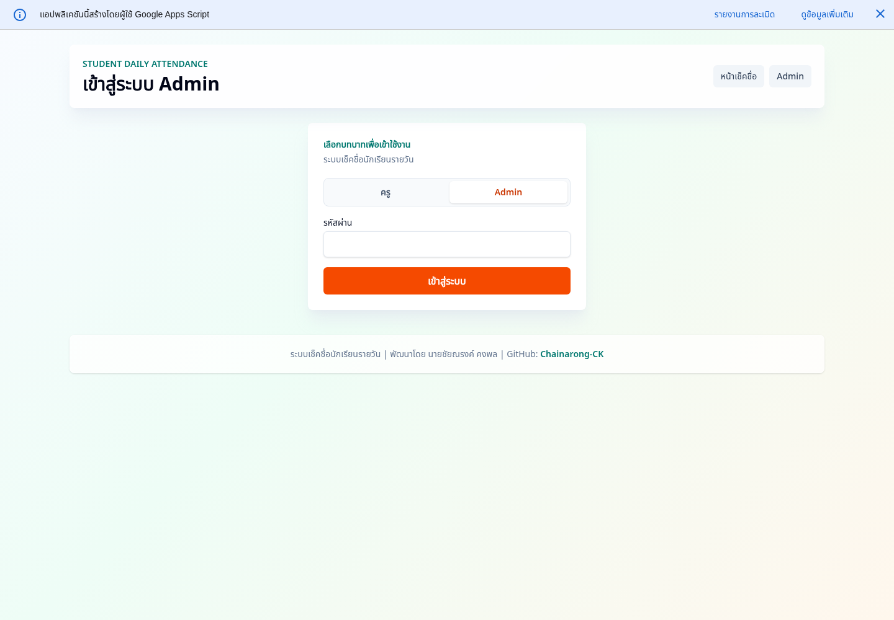

1. เปิดหน้า Login แล้วกดบทบาท **Admin**
2. กรอกรหัสผ่าน Admin ในช่อง **รหัสผ่าน**
3. กด **เข้าสู่ระบบ**
4. เมื่อรหัสผ่านถูกต้อง ระบบจะพาไปหน้าจัดการระบบ

> **คำแนะนำด้านความปลอดภัย:** ไม่ควรบอกรหัสผ่าน Admin แก่ผู้ใช้งานทั่วไป หากใช้งานบนเครื่องสาธารณะควรกด **ออกจากระบบ** ทุกครั้งเมื่อใช้งานเสร็จ

## 3. การใช้งานสำหรับครู

หน้าเช็คชื่อประกอบด้วย 3 แท็บ ได้แก่ **ภาพรวม**, **เช็คชื่อรายห้อง** และ **สถิติละเอียด** ข้อมูลทุกแท็บอ้างอิงปีการศึกษาและเทอมปัจจุบันที่ Admin เลือกไว้

### 3.1 ดูภาพรวมรายวัน

**ก่อนมีข้อมูลนักเรียนและการเช็คชื่อ** ระบบจะแสดงค่าเป็นศูนย์ และยังไม่มีรายละเอียดห้องเรียนในตาราง

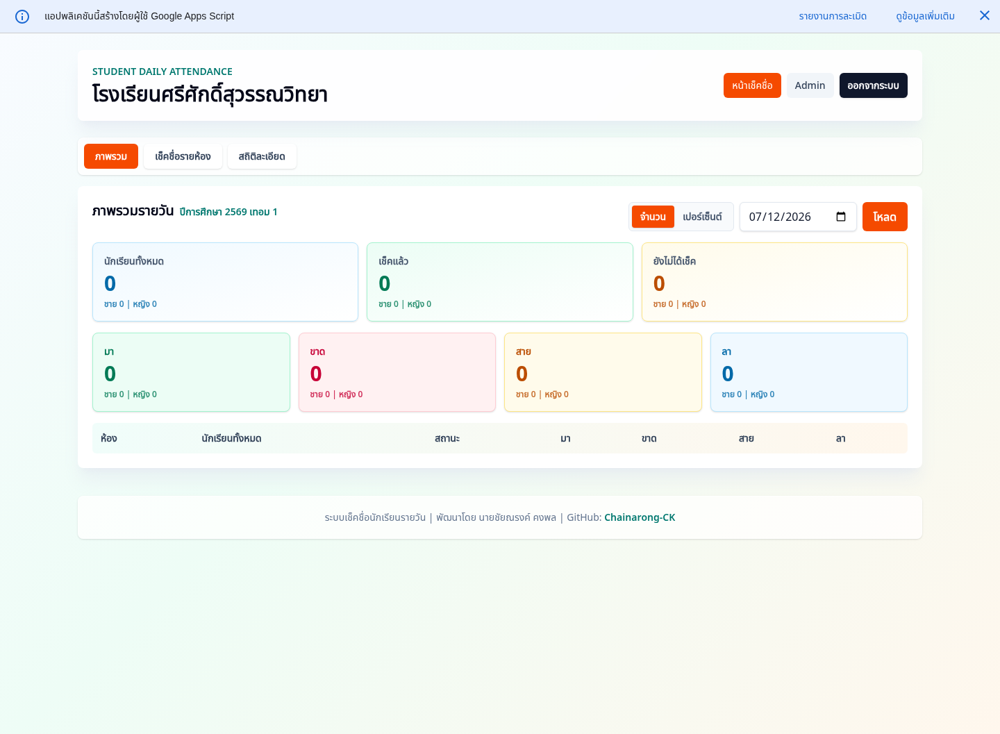

1. เปิดแท็บ **ภาพรวม**
2. เลือกวันที่ที่ต้องการตรวจสอบ
3. เลือกรูปแบบการแสดงผล **จำนวน** หรือ **เปอร์เซ็นต์**
4. กด **โหลด**

หน้าภาพรวมแสดงข้อมูลต่อไปนี้

- จำนวนนักเรียนที่กำลังศึกษาทั้งหมด
- จำนวนที่เช็คชื่อแล้วและยังไม่ได้เช็ค
- จำนวนสถานะ มา ขาด สาย และลา
- จำนวนย่อยแยกชายและหญิง
- สถานะการเช็คชื่อและผลรวมแยกตามห้องเรียน

คำว่า **ยังไม่เช็ค** ในตารางหมายถึงยังไม่มีการบันทึกเช็คชื่อของห้องนั้นในวันที่เลือก

**หลังเพิ่มนักเรียนและบันทึกการเช็คชื่อ** ระบบจะแสดงผลรวม มา ขาด สาย ลา ตัวเลขแยกเพศ และสถานะของแต่ละห้องดังภาพ

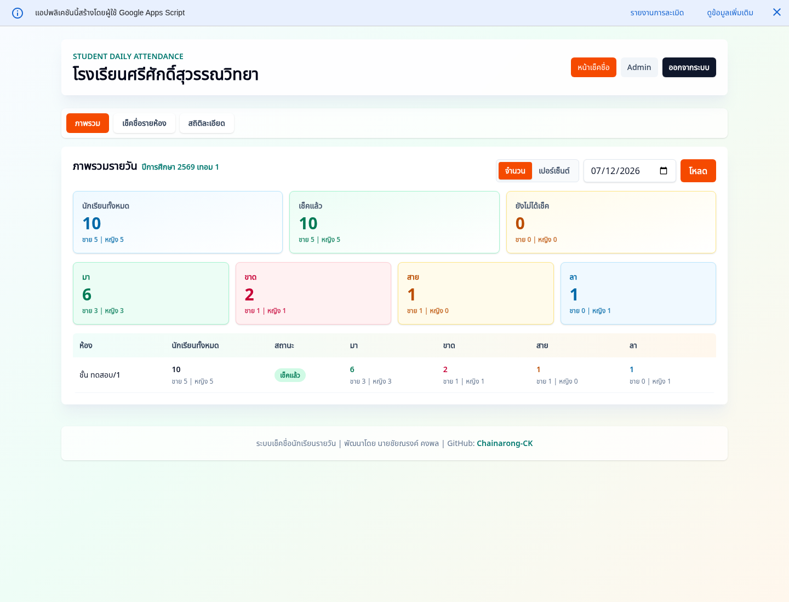

### 3.2 เช็คชื่อรายห้อง

เมื่อเปิดแท็บครั้งแรกและยังไม่ได้เลือกห้อง ระบบจะแสดงเพียงช่องเลือกห้อง วันที่ และข้อความแนะนำ

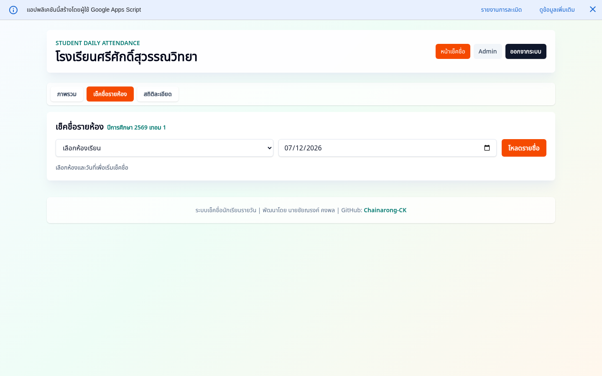

1. เปิดแท็บ **เช็คชื่อรายห้อง**
2. เลือกห้องเรียน
3. เลือกวันที่
4. กด **โหลดรายชื่อ**

   หลังโหลดสำเร็จ ระบบจะแสดงรายชื่อนักเรียนและช่องเลือกสถานะ โดยข้อมูลที่ยังไม่เคยบันทึกจะแสดงข้อความ **ยังไม่เคยเช็คชื่อ สามารถบันทึกได้ทันที**

   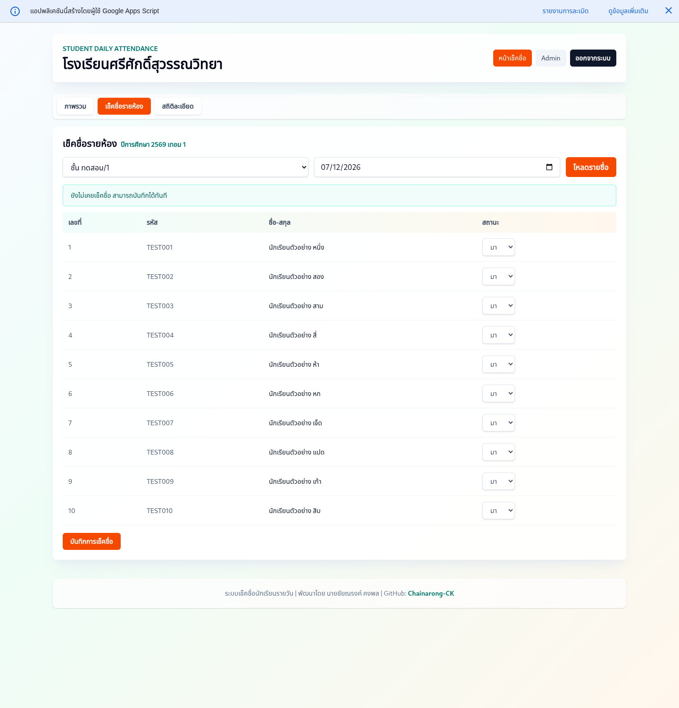

5. ตรวจสอบเลขที่ รหัสนักเรียน และชื่อ-สกุล
6. เลือกสถานะของนักเรียนแต่ละคน
7. ตรวจสอบให้ครบทุกคน แล้วกด **บันทึกการเช็คชื่อ**

สถานะที่ใช้ในระบบมี 4 ค่า

| สถานะ | ความหมาย |
| --- | --- |
| มา | เข้าเรียนตามปกติ |
| ขาด | ไม่มาเรียนและไม่มีการลา |
| สาย | มาเรียนแต่เข้าช้ากว่าเวลาที่กำหนด |
| ลา | ได้รับแจ้งหรืออนุญาตให้ลา |

เมื่อโหลดรายชื่อที่ยังไม่เคยเช็ค ระบบจะกำหนดสถานะเริ่มต้นเป็น **มา** ทุกคน ครูควรตรวจและเปลี่ยนเฉพาะผู้ที่ขาด สาย หรือลาก่อนบันทึก

หากวันและห้องที่เลือกเคยบันทึกแล้ว ระบบจะแสดงข้อมูลเดิมและเปลี่ยนปุ่มเป็น **บันทึกการแก้ไข** การบันทึกครั้งนี้จะอัปเดตข้อมูลเดิม ไม่สร้างรายการซ้ำ

หาก Admin เปลี่ยนปีการศึกษา เทอม หรือ Google Sheet ขณะที่หน้านี้เปิดอยู่ ระบบจะไม่ยอมบันทึกด้วยข้อมูลจากหน้าจอเก่า ให้โหลดหน้าใหม่แล้วตรวจสอบห้อง วันที่ และสถานะอีกครั้ง

หากมีครูอีกคนบันทึกวันและห้องเดียวกันหลังจากที่คุณโหลดรายชื่อ ระบบจะปฏิเสธข้อมูลจากหน้าจอเดิมเพื่อไม่ให้ผลล่าสุดถูกทับ ให้กดโหลดรายชื่อใหม่ ตรวจสอบการเปลี่ยนแปลง แล้วจึงบันทึกอีกครั้ง

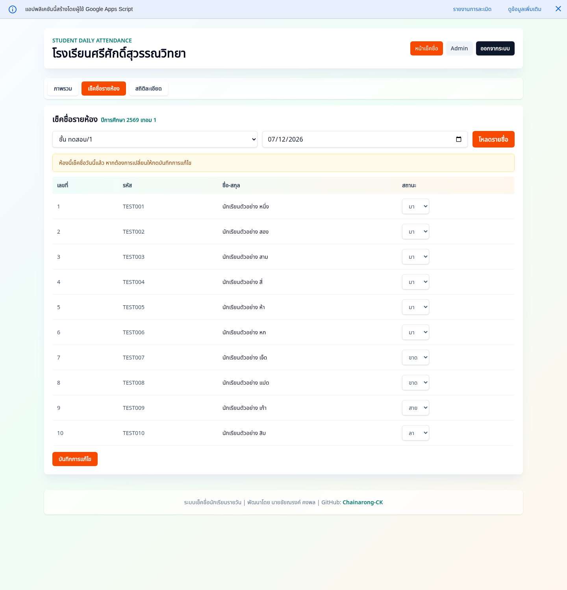

### 3.3 ดูสถิติละเอียด

เมื่อยังไม่ได้กำหนดช่วงวันที่ พื้นที่ผลลัพธ์จะแสดงข้อความ **เลือกช่วงวันที่แล้วกดดูสถิติ**

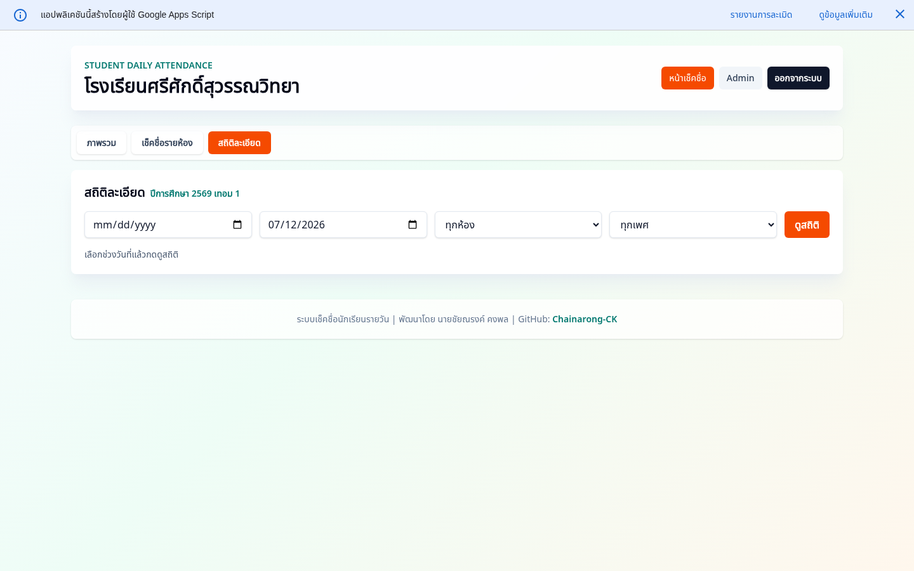

1. เปิดแท็บ **สถิติละเอียด**
2. เลือกวันที่เริ่มต้นและวันที่สิ้นสุด
3. เลือกห้องเรียน หรือเลือก **ทุกห้อง**
4. เลือกเพศ หรือเลือก **ทุกเพศ**
5. กด **ดูสถิติ**

ตารางผลลัพธ์จะแสดงห้อง เลขที่ ชื่อ-สกุล เพศ จำนวนและเปอร์เซ็นต์ของสถานะ มา ขาด สาย ลา รวมถึงจำนวนวันที่มีข้อมูลของนักเรียนแต่ละคน

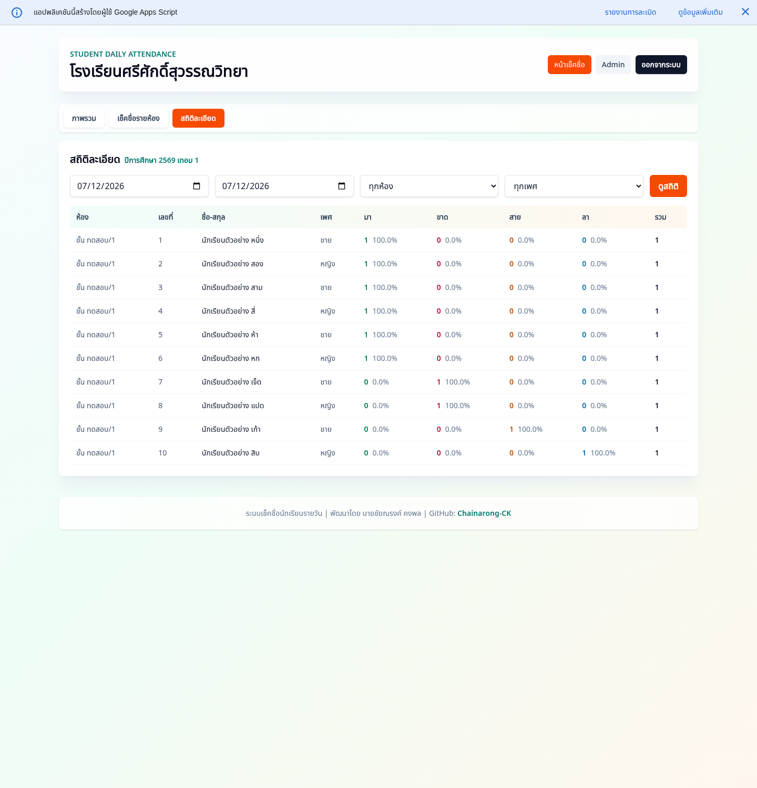

### 3.4 ออกจากระบบ

กด **ออกจากระบบ** ที่มุมขวาบนเมื่อใช้งานเสร็จ โดยเฉพาะเมื่อใช้เครื่องร่วมกับผู้อื่น หาก session หมดอายุ ระบบจะพากลับไปหน้า Login และต้องกรอกรหัสผ่านอีกครั้ง

## 4. การใช้งานสำหรับ Admin

หน้า Admin ใช้จัดการค่าระบบ ปีการศึกษา ห้องเรียน รายชื่อนักเรียน และการลบข้อมูลถาวร การแก้ไขในหน้านี้มีผลต่อข้อมูลที่ครูเห็น จึงควรตรวจสอบก่อนกดบันทึกทุกครั้ง

### 4.1 ตั้งค่าระบบและเปลี่ยนรหัสผ่าน

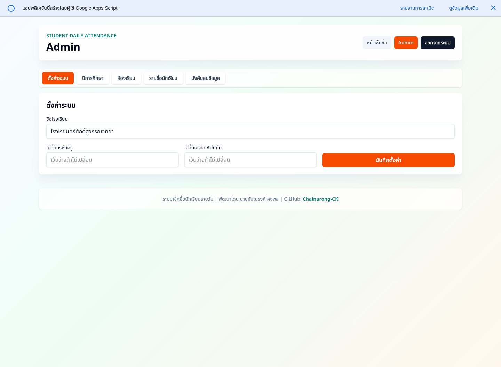

1. เปิดแท็บ **ตั้งค่าระบบ**
2. แก้ไขชื่อโรงเรียนได้จากช่อง **ชื่อโรงเรียน**
3. หากต้องการเปลี่ยนรหัสครูหรือ Admin ให้กรอกรหัสใหม่ในช่องที่เกี่ยวข้อง
4. หากไม่ต้องการเปลี่ยนรหัสผ่าน ให้เว้นช่องรหัสผ่านว่าง
5. กด **บันทึกตั้งค่า**

### 4.2 จัดการปีการศึกษาและเทอม

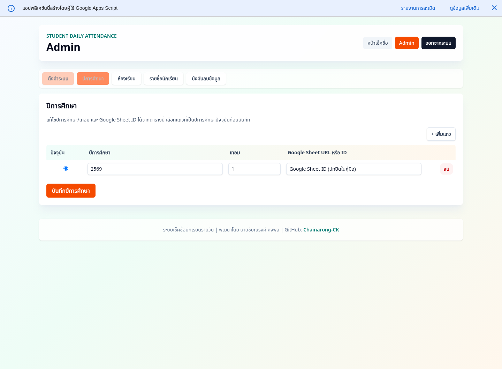

1. เปิดแท็บ **ปีการศึกษา**
2. กด **+ เพิ่มแถว** เมื่อต้องการเพิ่มปีการศึกษาหรือเทอม
3. กรอกปีการศึกษา เทอม และ Google Sheet URL หรือ ID
4. เลือกวงกลมในคอลัมน์ **ปัจจุบัน** ให้มีหนึ่งรายการ
5. กด **บันทึกปีการศึกษา**

ข้อกำหนดสำคัญ

- ปีการศึกษาและเทอมคู่เดียวกันห้ามซ้ำ
- Google Sheet ID ห้ามซ้ำ
- เทอมต้องอยู่ระหว่าง `1` ถึง `3`
- ต้องมีปีการศึกษาอย่างน้อยหนึ่งรายการ และต้องเลือกปีการศึกษาปัจจุบัน
- ระบบรองรับรายการปีการศึกษาและเทอมรวมไม่เกิน 50 รายการ

> ในภาพตัวอย่างมีการปกปิด Google Sheet ID เพื่อความปลอดภัย คู่มือใช้งานจริงควรหลีกเลี่ยงการเผยแพร่ ID พร้อมสิทธิ์เข้าถึงไฟล์

### 4.3 จัดการห้องเรียน

เมื่อกด **+ เพิ่มแถว** ระบบจะแสดงแถวว่างสำหรับกรอกระดับชั้นและห้อง

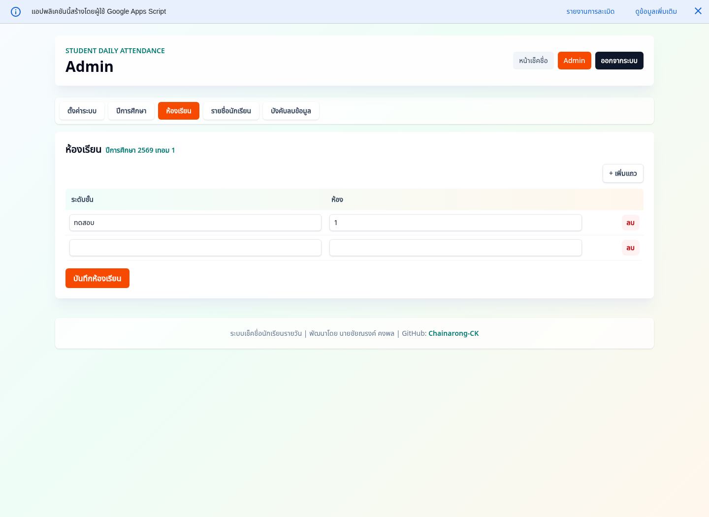

1. เปิดแท็บ **ห้องเรียน**
2. กด **+ เพิ่มแถว**
3. กรอกระดับชั้น เช่น `ม.1` และห้อง เช่น `1`
4. เพิ่มแถวอื่นตามต้องการ
5. กด **บันทึกห้องเรียน**

หลังบันทึกสำเร็จ แถวห้องเรียนจะมี ID ภายในระบบและพร้อมให้เลือกในหน้ารายชื่อนักเรียนและหน้าเช็คชื่อ

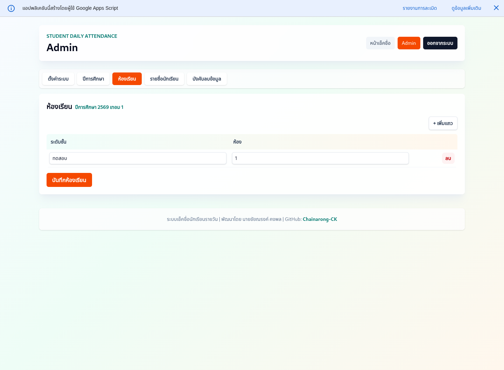

ระบบไม่อนุญาตให้มีระดับชั้นและห้องซ้ำกันในปีการศึกษาเดียวกัน และรองรับไม่เกิน 20 ห้องต่อปีการศึกษา/เทอม

เมื่อต้องการลบ ให้กด **ลบ** ที่แถวนั้น แถวจะถูกทำเครื่องหมายว่าจะลบเมื่อบันทึกและสามารถกด **ยกเลิก** ได้ หากห้องยังมีนักเรียน ระบบจะไม่อนุญาตให้ลบจนกว่าจะจัดการนักเรียนในห้องก่อน

### 4.4 จัดการรายชื่อนักเรียน

เมื่อห้องที่เลือกยังไม่มีนักเรียน ตารางด้านล่างจะยังไม่มีแถวข้อมูล สามารถเพิ่มด้วยปุ่ม **+ เพิ่มแถว** หรือส่วน Import CSV

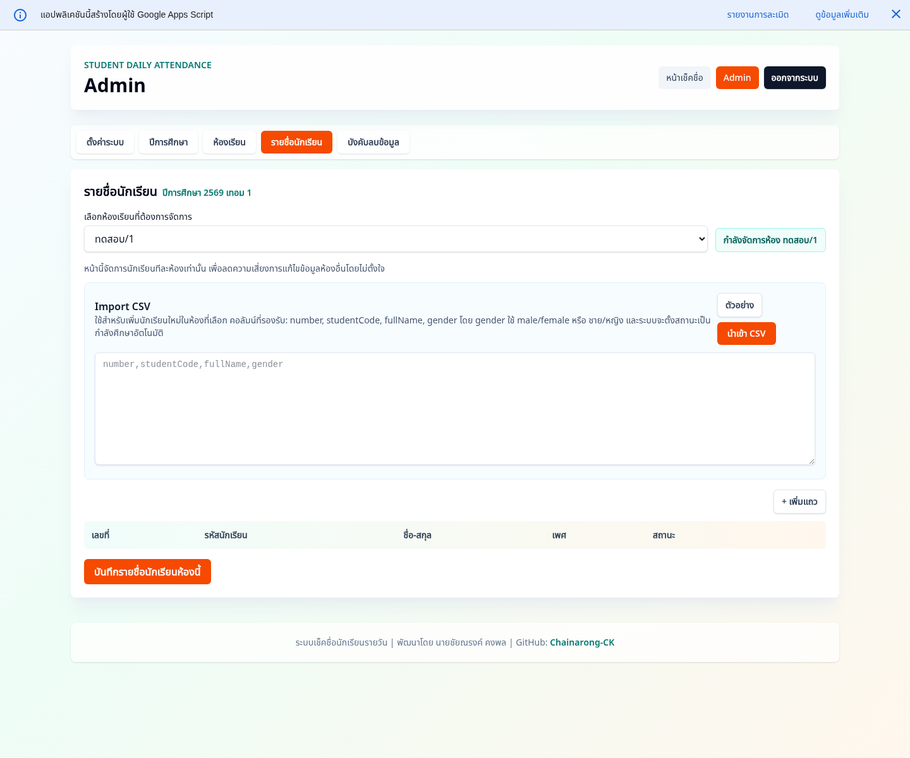

1. เปิดแท็บ **รายชื่อนักเรียน**
2. เลือกห้องเรียนที่ต้องการจัดการ
3. กด **+ เพิ่มแถว** แล้วกรอกเลขที่ รหัสนักเรียน ชื่อ-สกุล เพศ และสถานะ
4. ตรวจสอบว่ากำลังจัดการห้องที่ถูกต้อง
5. กด **บันทึกรายชื่อนักเรียนห้องนี้**

หลังบันทึก ระบบจะแสดงนักเรียนทุกคนในห้องที่เลือกดังภาพ

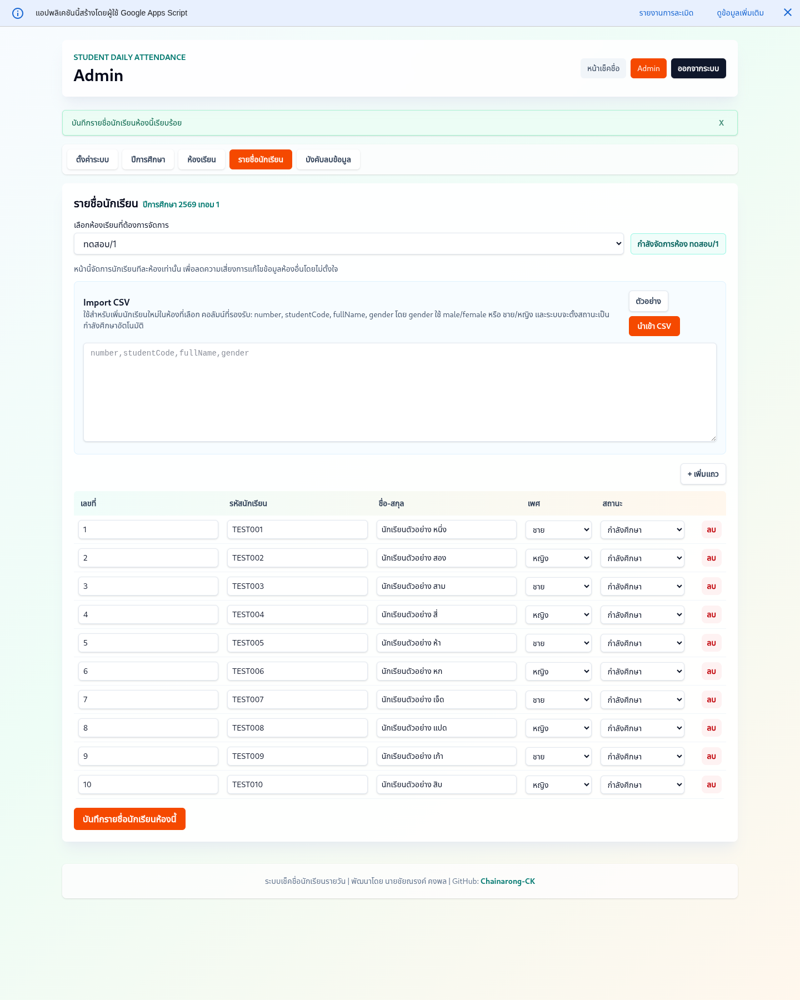

สถานะนักเรียนมี 2 ค่า

| สถานะ | การทำงาน |
| --- | --- |
| กำลังศึกษา | แสดงในรายชื่อสำหรับเช็คชื่อ |
| ออก/พักเรียน | เก็บข้อมูลเดิมไว้ แต่ไม่แสดงในรายชื่อเช็คชื่อใหม่ |

ข้อกำหนดสำคัญ

- เลขที่ห้ามซ้ำในห้องเดียวกัน
- รหัสนักเรียนห้ามซ้ำ หากมีการกรอก
- ต้องเลือกเพศชายหรือหญิงก่อนบันทึก
- รองรับนักเรียนไม่เกิน 500 คนต่อปีการศึกษา/เทอม
- นักเรียนที่มีประวัติเช็คชื่อควรเปลี่ยนสถานะเป็น **ออก/พักเรียน** แทนการลบ

### 4.5 นำเข้านักเรียนด้วย CSV

ที่ส่วน **Import CSV** สามารถเพิ่มนักเรียนหลายคนพร้อมกันได้ โดยใช้หัวคอลัมน์ตามลำดับนี้

```csv
number,studentCode,fullName,gender
1,10001,นักเรียนตัวอย่าง หนึ่ง,male
2,10002,นักเรียนตัวอย่าง สอง,female
```

หลังวาง CSV และก่อนกดนำเข้า ควรตรวจหัวคอลัมน์และข้อมูลทุกบรรทัดดังภาพ

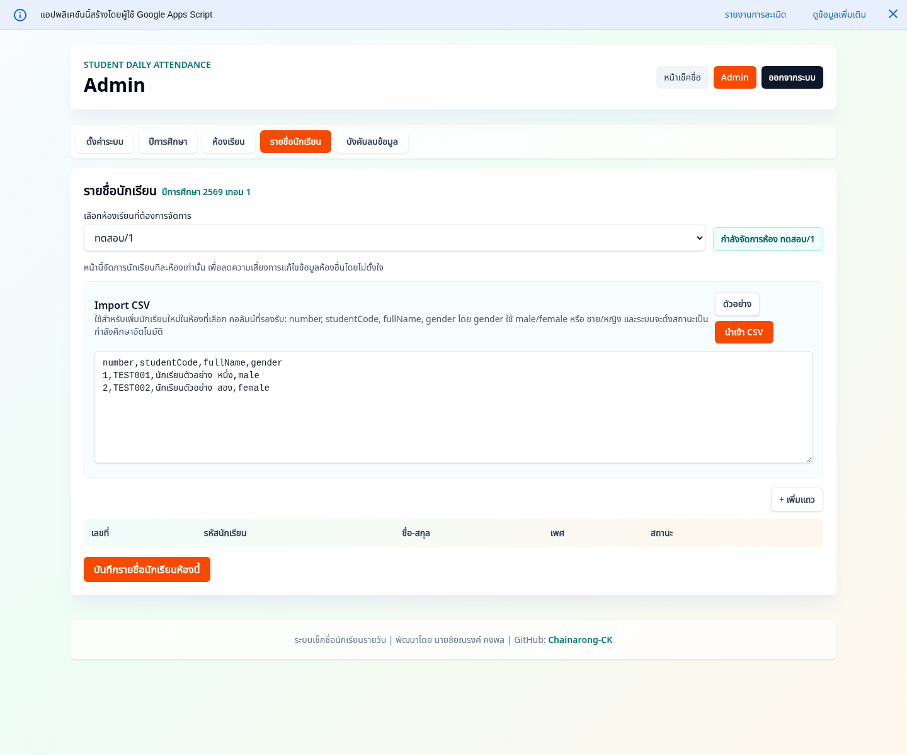

ขั้นตอนนำเข้า

1. เลือกห้องเรียนปลายทาง
2. วางข้อมูล CSV ในช่องข้อความ หรือกด **ตัวอย่าง** เพื่อดูรูปแบบ
3. กด **นำเข้า CSV**
4. ตรวจสอบข้อมูลที่เพิ่มลงในตาราง
5. กด **บันทึกรายชื่อนักเรียนห้องนี้** อีกครั้ง จึงจะบันทึกลง Google Sheet

ค่า `gender` ใช้ `male`, `female`, `ชาย` หรือ `หญิง` ได้ นักเรียนที่นำเข้าจะถูกตั้งสถานะเป็นกำลังศึกษาอัตโนมัติ

### 4.6 บังคับลบนักเรียนและประวัติการเช็คชื่อ

ก่อนเลือกนักเรียน ระบบจะแสดงจำนวนที่เลือกเป็นศูนย์ ช่องยืนยันยังว่าง และปุ่มบังคับลบยังใช้งานไม่ได้

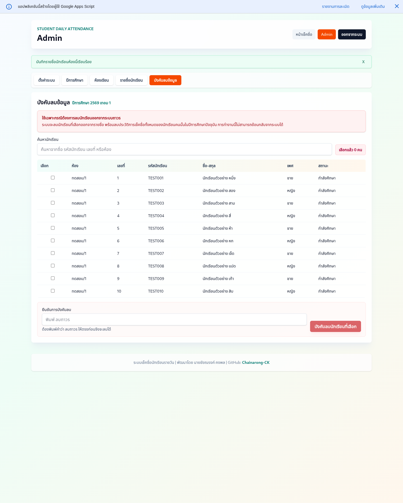

ใช้เมื่อต้องการลบนักเรียนออกจากระบบถาวรพร้อมประวัติการเช็คชื่อทั้งหมดของนักเรียนคนนั้นเท่านั้น

1. เปิดแท็บ **บังคับลบข้อมูล**
2. ค้นหาจากชื่อ รหัสนักเรียน เลขที่ หรือห้อง
3. เลือกนักเรียนที่ต้องการลบ
4. ตรวจสอบจำนวนที่เลือก
5. พิมพ์คำยืนยัน `ลบถาวร`
6. กด **บังคับลบนักเรียนที่เลือก**
7. อ่านข้อความยืนยันและยืนยันอีกครั้ง

เมื่อเลือกนักเรียนและพิมพ์ `ลบถาวร` ถูกต้อง ปุ่มบังคับลบจึงจะเปิดใช้งานดังภาพ ขั้นตอนนี้ยังไม่ลบข้อมูลจนกว่าจะกดปุ่มและยืนยันใน dialog

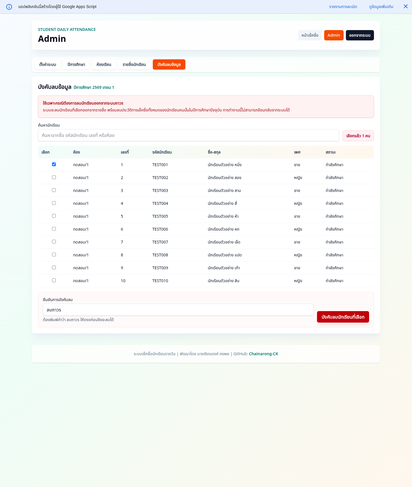

> **คำเตือน:** การทำงานนี้ลบนักเรียนและประวัติการเช็คชื่อจากปีการศึกษาปัจจุบัน ไม่สามารถย้อนกลับผ่านระบบได้ ควรสำรอง Google Sheet ก่อนดำเนินการ ระบบจำกัดการบังคับลบครั้งละไม่เกิน 50 คน

## 5. แนวทางดูแลข้อมูล

- สำรอง Google Sheet ก่อนเปลี่ยนข้อมูลจำนวนมากหรือลบถาวร
- ไม่ควรแก้ชื่อชีต หัวคอลัมน์ หรือ ID ภายในชีตด้วยตนเอง
- แยก Google Sheet ตามปีการศึกษาและเทอมตามที่ระบบกำหนด
- ตรวจสอบปีการศึกษาปัจจุบันก่อนเพิ่มห้อง นักเรียน หรือเช็คชื่อ
- จำกัดสิทธิ์แก้ไข Google Sheet เฉพาะผู้รับผิดชอบ
- หลีกเลี่ยงการส่งรหัสผ่านหรือ token ผ่านแชตและช่องทางสาธารณะ

## 6. การแก้ไขปัญหาเบื้องต้น

| อาการ | วิธีตรวจสอบ |
| --- | --- |
| เข้าสู่ระบบไม่ได้ | ตรวจสอบบทบาทและรหัสผ่าน หาก Admin เปลี่ยนรหัสแล้วให้ใช้รหัสใหม่ |
| ระบบพากลับหน้า Login | session อาจหมดอายุ ให้เข้าสู่ระบบใหม่ |
| ไม่พบห้องในหน้าเช็คชื่อ | ตรวจว่ามีห้องในปีการศึกษาปัจจุบันและกดบันทึกแล้ว |
| ห้องไม่มีรายชื่อนักเรียน | เพิ่มนักเรียนผ่านหน้า Admin และตั้งสถานะเป็นกำลังศึกษา |
| บันทึกนักเรียนไม่ได้ | ตรวจเลขที่ซ้ำ รหัสนักเรียนซ้ำ ช่องชื่อ และเพศ |
| นำเข้า CSV ไม่ได้ | ตรวจหัวคอลัมน์ `number,studentCode,fullName,gender` และข้อมูลซ้ำ |
| ลบห้องไม่ได้ | ห้องยังมีนักเรียนอยู่ ให้จัดการนักเรียนก่อน |
| เปิด Google Sheet ไม่ได้ | ตรวจ Sheet ID และสิทธิ์ของบัญชีที่ deploy Web App |
| วันที่เคยเช็คแล้ว | โหลดข้อมูลเดิมและใช้ปุ่ม **บันทึกการแก้ไข** |

หากพบปัญหา ควรบันทึกข้อความแจ้งเตือน หน้าที่ใช้งาน วันที่ ห้องเรียน และขั้นตอนก่อนเกิดปัญหา เพื่อให้ผู้ดูแลตรวจสอบได้รวดเร็ว
